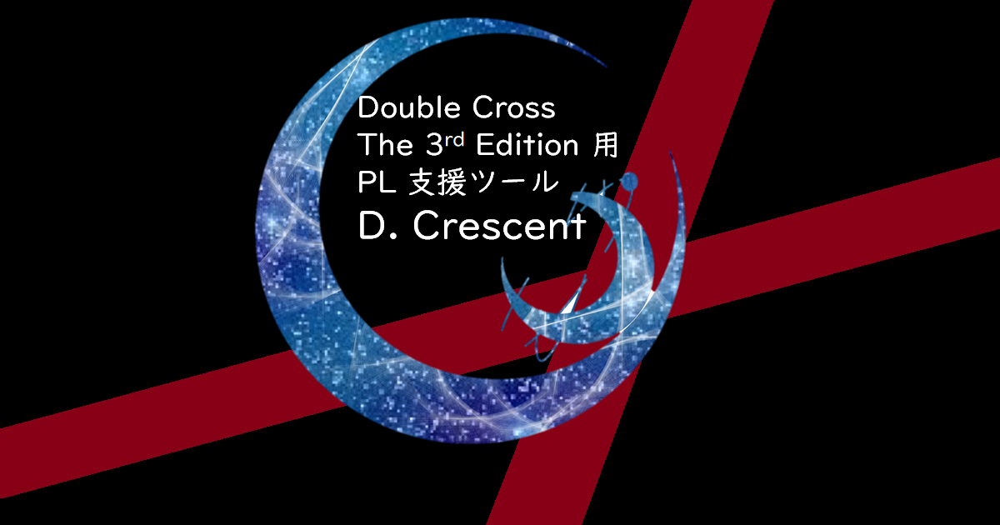

# D. Crescent

## どんなツール

D. Crescent は オンセにおけるダブルクロス the 3rd Edition ([公式ページ](http://www.fear.co.jp/dbx3rd/)) のセッションテンポを向上させたい GM/プレイヤー 向けの PC 管理用ツール。   
ユーザはスムーズな判定や情報共有を実現でき、チャットパレットに比較して他プレイヤーとの情報共有や修正値の管理の面で強力である。

(という目標を実現するために [つける機能一覧](./docs/FunctionList.md))

### ツールを使う

[http://shunshun94.web.fc2.com/dx3/main/index.html](http://shunshun94.web.fc2.com/dx3/main/index.html)

### ソースコードリポジトリ

https://github.com/Shunshun94/D.Crescent

### プレ公開

- [ロイス/タイタス および メモリーの管理](./units/lois.html)
- [判定の管理](./units/dice.html)

### 更新履歴

[更新履歴](./docs/version.md)

## どうやって使うの

### 実セッションで使う

[http://shunshun94.web.fc2.com/dx3/main/index.html](http://shunshun94.web.fc2.com/dx3/main/index.html) から利用可能。

利用の際は以下の2つを事前準備する必要がある。

#### キャラクターシート

以下のどちらかでキャラクターシートを作る。

* [キャラクター保管所](https://charasheet.vampire-blood.net/dx3_pc_making.html)
* [キャラクターシート倉庫](https://character-sheets.appspot.com/dx3/)

本アプリはどちらで作ったキャラクターシートにも対応する。
[キャラクターシート入力のコツ](./docs/characterSheet.md)も参照すること。

#### オンセ会場

以下のオンセプラットフォームに対応している。

* どどんとふ
* Discord

どちらかで部屋を用意すること。

また、動作を試すために、オンセプラットフォームに接続せず、ローカルだけで動かすことも可能である。

#### Discord で利用する場合の注意点

Discord で利用する場合、部屋とは別に以下を用意する必要がある。

* bot の作成
* BCDice-API サーバの用意

##### Bot の作成

Discord で Bot を用意するには以下の手順を踏む必要がある。
以下の手順 4 で得た Token が必要となる。この Token は他の人には原則共有しないこと。
その Bot を使うためのパスワードのようなものだからである。

1. [開発者ページ](https://discordapp.com/developers/applications/me) にアクセスし、New APP をクリックする
2. 最低限 APP NAME と APP ICON を入力し、 Create App をクリックする
3. Create Bot User というボタンをクリックし、このダイスボット用のユーザを作成する
4. Bot の Username の下に "Token:click to reveal" というのがあるのでクリックし、出てくるランダムな文字列をメモする
5. 画面上部の APP DETAILS のところに書かれた Client ID の数字をメモする
6. 次の URL にアクセスする `https://discordapp.com/oauth2/authorize?client_id=[Client Id の数字]&scope=bot&permissions=0`

Discord の bot に関する公式の情報は [Discord - Developer Documentation TOPICS ＞ OAuth2 ＞ Bots](https://discordapp.com/developers/docs/topics/oauth2#bots) から確認できる。

##### BCDice-API サーバの用意

BCDice-API サーバは自分で用意してもかまわないし、他の人が用意した既存のものを利用してもかまわない。
[BCDice-API サーバのリポジトリ](https://github.com/ysakasin/bcdice-api) により詳しい情報がある。

### デプロイする

本リポジトリの main 以下を任意のウェブサーバにデプロイし、
ユーザを `/main/index.html` にアクセスするように誘導することで利用が可能。

## ライセンス

### このアプリのライセンス

[MIT　ライセンス](./LICENSE)

### 使った外部ライブラリのライセンス

#### jQuery v.3.1.0

Copyright (c) 2005, 2016 jQuery Foundation, Inc.

MIT ライセンスです。

ライセンス情報:  https://jquery.org/license/

#### jQuery UI v.1.12.1

Copyright (c) jQuery Foundation and other contributors

MIT ライセンスです。

ライセンス情報:  https://jquery.org/license/

#### discord.io

Copyright (c) 2015 izy521

MIT ライセンスです。

ライセンス情報:  https://github.com/izy521/discord.io/blob/master/LICENSE

#### OGP 画像の一部

[nanoha さん](https://prcm.jp/user/czFoHR2) 作成の加工素材を用いて作成しています。   
素材 URL: [https://prcm.jp/album/f0aa66330945b/pic/70491381](https://prcm.jp/album/f0aa66330945b/pic/70491381)

ライセンスは下記の通り。

【注意点】   
☆自作発言✕   
☆Twitter垢は自作発言防止のため(邪魔ですみません)   
☆｢やり方教えてください｣✕   
☆保存のみ△   
☆いいね→保存◎   
☆リクエスト◎   
☆コメント◎   
☆フォロー◎   
☆無言フォローごめんなさい   
☆トプ画やホーム画などのSNSで公開される画像への使用◎   
☆再加工◎   
☆☝︎からの再配布◎   

ライセンス情報：　https://prcm.jp/user/czFoHR2